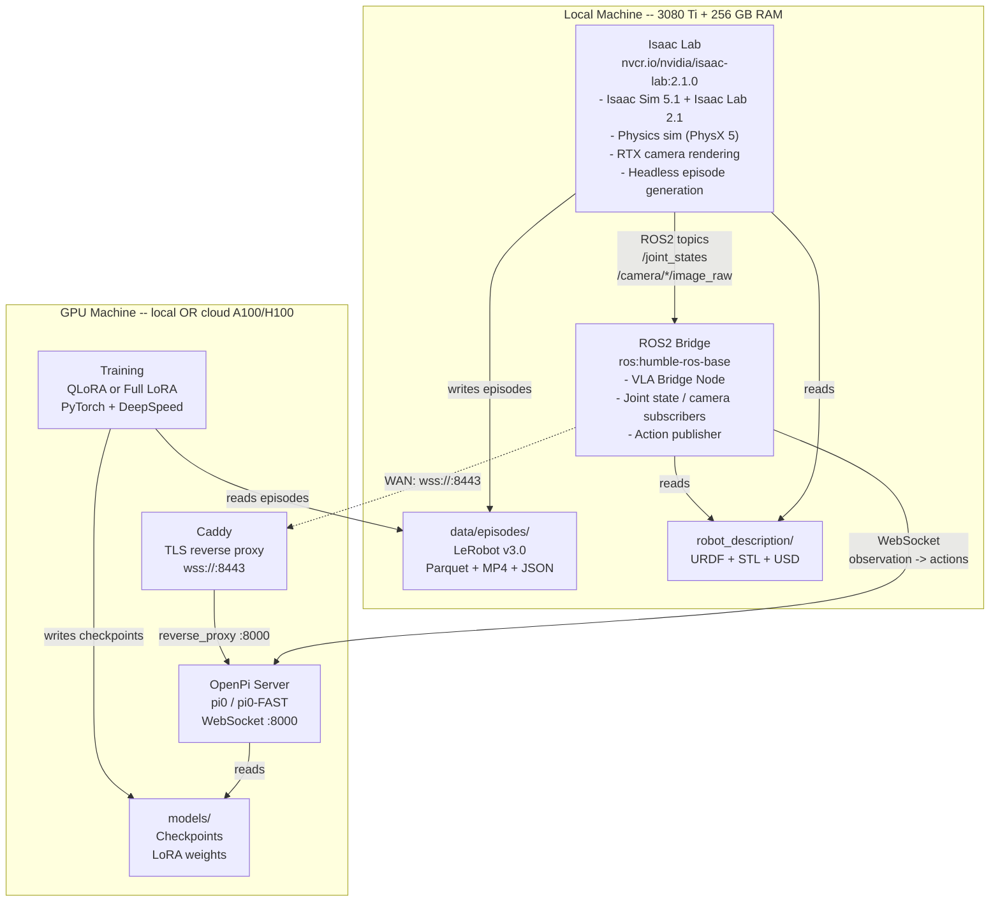
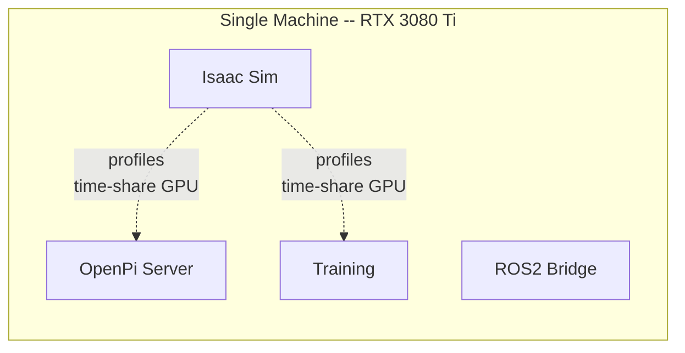
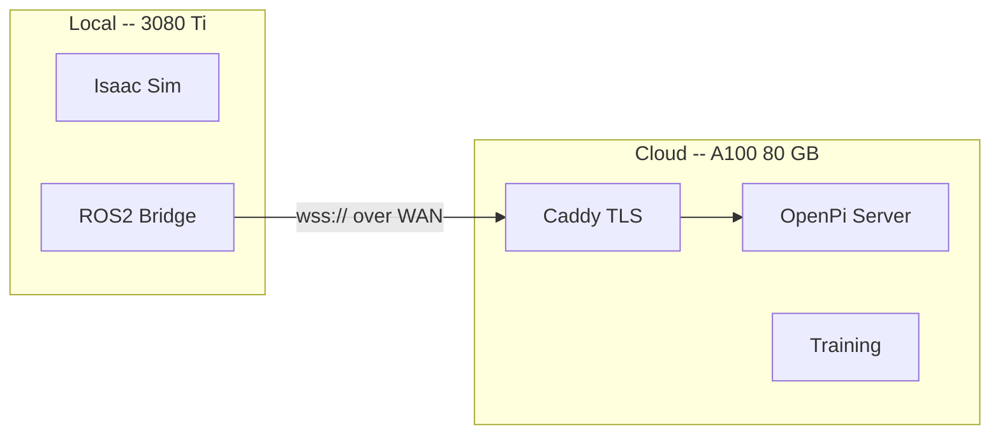
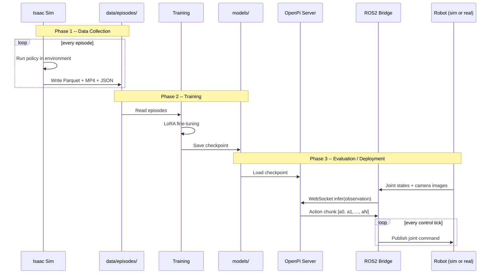
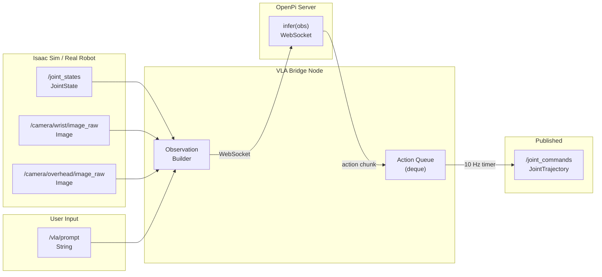

# Architecture

This document describes the system architecture, data flows, and component
interactions of the VLA Robot Full Stack for SO-ARM101.

---

## System Overview

The stack is split into two logical groups of Docker containers that can run
on the **same machine** (Mode A) or on **separate machines** (Mode B).



---

## Deployment Modes

### Mode A -- All Local

Every container runs on the same GPU machine. Docker Compose **profiles**
time-share the single GPU because Isaac Sim, OpenPi inference, and training
cannot coexist in 12 GB of VRAM simultaneously.



| Profile | Containers started | GPU usage |
|---|---|---|
| `collect` | Isaac Sim + ROS2 | ~8-10 GB |
| `train` | Training only | ~10-12 GB |
| `eval-local` | Isaac Sim + OpenPi + ROS2 | ~10 GB |
| `deploy-local` | OpenPi + ROS2 | ~4-6 GB |

### Mode B -- Split (Local + Remote)

Isaac Sim and ROS2 run locally.  OpenPi and training run on a remote GPU,
connected via WebSocket over the network.



| Profile | Local containers | Remote containers |
|---|---|---|
| `eval-remote` | Isaac Sim + ROS2 | OpenPi + Caddy |
| `deploy-remote` | ROS2 only | OpenPi + Caddy |
| (training) | -- | Training |

Switching modes requires only changing `OPENPI_HOST` in `docker/.env`.

---

## Container Details

### 1. Isaac Sim

| | |
|---|---|
| **Image** | `nvcr.io/nvidia/isaac-lab:2.1.0` (Isaac Sim 5.1 + Isaac Lab 2.1 pre-installed) |
| **GPU** | Required (RT cores) |
| **Dockerfile** | `docker/isaac-sim/Dockerfile` |
| **Volumes** | `robot_description`, `isaac_envs`, `data` |

Runs NVIDIA Isaac Sim with Isaac Lab extensions.  Two custom environments
load the SO-ARM101 from its USD asset and expose Gymnasium-compatible APIs:

- **SoarmReachEnv** -- Move end-effector to a random XYZ target.
- **SoarmPickEnv** -- Grasp a cube and place it at a target.

The `sim_data_collector.py` script runs a policy inside the environment,
recording observations and actions into LeRobot v3.0 format.

### 2. OpenPi Server

| | |
|---|---|
| **Base** | `nvidia/cuda:12.4.0-runtime-ubuntu22.04` |
| **GPU** | Required for inference |
| **Dockerfile** | `docker/openpi-server/Dockerfile` |
| **Port** | 8000 (WebSocket) |

Clones Physical Intelligence's
[openpi](https://github.com/Physical-Intelligence/openpi) repository,
installs it with `uv`, and starts `serve_policy.py`.  The server loads a
checkpoint (base model or fine-tuned LoRA), accepts observation dicts over
WebSocket, and returns action chunks.

### 3. ROS2 Bridge

| | |
|---|---|
| **Base** | `ros:humble-ros-base-jammy` |
| **GPU** | Not required |
| **Dockerfile** | `docker/ros2-bridge/Dockerfile` |

Contains three ROS2 packages:

| Package | Purpose |
|---|---|
| `soarm_description` | URDF, meshes, TF publishing |
| `soarm_moveit_config` | MoveIt2 SRDF (placeholder) |
| `soarm_vla_bridge` | VLA bridge node (core) |

The **VLA bridge node** is the central piece: it subscribes to sensor topics,
builds an observation dict, sends it to the OpenPi server, and publishes the
returned actions as joint trajectory commands.

### 4. Training

| | |
|---|---|
| **Base** | `nvidia/cuda:12.4.0-devel-ubuntu22.04` |
| **GPU** | Required |
| **Dockerfile** | `docker/training/Dockerfile` |

Same OpenPi codebase as the server, plus `bitsandbytes`, `peft`,
`deepspeed`, and `accelerate` for memory-efficient fine-tuning.

### 5. Caddy (Cloud only)

| | |
|---|---|
| **Image** | `caddy:2-alpine` |
| **GPU** | Not required |
| **Ports** | 8443, 443 |

TLS reverse proxy that terminates `wss://` connections from the local
machine and forwards them to the OpenPi server on port 8000.

---

## Data Flow



---

## ROS2 Topic Map



---

## File Map

```
isaac-sim-soarm101/
├── docker/
│   ├── docker-compose.yml ........... Local stack orchestration
│   ├── docker-compose.cloud.yml ..... Remote GPU stack
│   ├── .env ......................... Local environment vars
│   ├── .env.cloud ................... Cloud environment vars
│   ├── isaac-sim/
│   │   ├── Dockerfile
│   │   └── convert_urdf.py ......... URDF -> USD helper
│   ├── openpi-server/
│   │   ├── Dockerfile
│   │   ├── entrypoint.sh
│   │   └── Caddyfile ............... TLS proxy config
│   ├── ros2-bridge/
│   │   ├── Dockerfile
│   │   └── ros_entrypoint.sh
│   └── training/
│       ├── Dockerfile
│       └── entrypoint.sh
├── robot_description/
│   ├── urdf/soarm101.urdf .......... ROS2 mesh paths
│   ├── urdf/soarm101_isaacsim.urdf . Absolute mesh paths
│   ├── meshes/*.stl ................ 13 STL files
│   └── usd/soarm101.usd ........... Generated by convert_urdf.py
├── isaac_envs/
│   ├── soarm_reach_env.py .......... Reach-target task
│   ├── soarm_pick_env.py ........... Pick-and-place task
│   └── sim_data_collector.py ....... Episode recorder
├── ros2_ws/src/
│   ├── soarm_description/ .......... URDF + launch files
│   ├── soarm_moveit_config/ ........ MoveIt2 SRDF
│   └── soarm_vla_bridge/ ........... VLA bridge ROS2 node
│       └── soarm_vla_bridge/
│           ├── vla_bridge_node.py .. Main bridge node
│           └── observation_builder.py
├── training/
│   ├── configs/soarm_config.py ..... OpenPi DataConfig
│   └── scripts/
│       ├── compute_norm_stats.py
│       ├── train_lora.py
│       └── convert_sim_episodes.py
├── data/episodes/ .................. LeRobot v3.0 dataset
├── models/ ......................... Checkpoints + LoRA
└── scripts/ ........................ Workflow shell scripts
```
