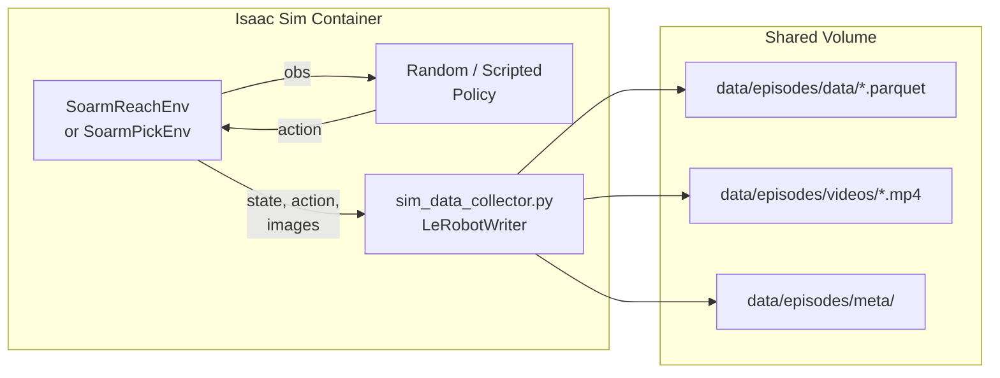

# Data Pipeline

How episodes are collected, stored, and consumed for training.

---

## LeRobot v3.0 Format

All episode data uses the [LeRobot v3.0](https://huggingface.co/docs/lerobot/lerobot-dataset-v3)
dataset format, which is the standard used by HuggingFace and compatible
with OpenPi's training infrastructure.

### Directory Layout

```
data/episodes/
├── meta/
│   ├── info.json                          Global metadata
│   ├── stats.json                         Normalization statistics
│   └── episodes/
│       ├── 000000.json                    Episode 0 metadata
│       ├── 000001.json                    Episode 1 metadata
│       └── ...
├── data/
│   └── train-00000-of-00001.parquet       Frame-by-frame tabular data
└── videos/
    ├── observation.images.wrist_episode_000000.mp4
    ├── observation.images.wrist_episode_000001.mp4
    └── ...
```

### info.json

```json
{
  "codebase_version": "v3.0",
  "robot_type": "so_arm101",
  "fps": 30,
  "total_episodes": 50,
  "total_frames": 7500,
  "features": {
    "observation.state": { "dtype": "float32", "shape": [6] },
    "action":            { "dtype": "float32", "shape": [6] }
  }
}
```

### Episode Metadata (per-episode JSON)

```json
{
  "episode_index": 0,
  "tasks": ["reach_target"],
  "length": 150
}
```

### Parquet Schema

Each row is one frame.  Columns:

| Column | Type | Description |
|---|---|---|
| `episode_index` | int | Which episode this frame belongs to |
| `frame_index` | int | Index within the episode (0-based) |
| `index` | int | Global frame counter |
| `timestamp` | float | Seconds since episode start |
| `observation.state` | list[float] | 6-element joint position vector |
| `action` | list[float] | 6-element action vector |
| `observation.state.shoulder_pan` | float | Individual joint (convenience) |
| `observation.state.shoulder_lift` | float | |
| `observation.state.elbow_flex` | float | |
| `observation.state.wrist_flex` | float | |
| `observation.state.wrist_roll` | float | |
| `observation.state.gripper` | float | |
| `action.shoulder_pan` | float | Individual action (convenience) |
| ... | | |

### Video Files

Camera images are stored as H.264 MP4 files, one per camera per episode.
Naming convention: `observation.images.{camera}_episode_{idx:06d}.mp4`.

---

## Data Collection Pipeline



### Running Collection

```bash
# Basic: 50 reach episodes, no camera
./scripts/collect_sim_data.sh --env reach --episodes 50

# With camera: adds wrist camera MP4s
./scripts/collect_sim_data.sh --env reach --episodes 50 --camera

# Pick-and-place
./scripts/collect_sim_data.sh --env pick --episodes 100 --camera
```

### Domain Randomization

The Isaac Lab environments apply the following randomization at each
episode reset:

| Parameter | Range | Purpose |
|---|---|---|
| Target position | X: 5-25 cm, Y: -15-15 cm, Z: 2-20 cm | Task diversity |
| Initial joints | Gaussian noise, sigma=0.1 rad | Starting pose variety |
| Cube position (pick) | X: 8-22 cm, Y: -10-10 cm | Object placement variety |
| Lighting | Dome light, 2000 lux | (constant, extend for randomization) |

To improve sim-to-real transfer, you can extend the environments with
texture randomization, camera noise, and dynamics randomization.

---

## Normalization Statistics

OpenPi requires per-feature normalization statistics (mean, std, min, max)
to normalize observations and actions during training and inference.

### Computing Statistics

```bash
# Run after data collection
python3 training/scripts/compute_norm_stats.py --data-dir data/episodes
```

This reads all Parquet files and writes `data/episodes/meta/stats.json`:

```json
{
  "observation.state": {
    "mean": [0.01, -0.05, 0.12, -0.03, 0.00, 0.00],
    "std":  [0.52,  0.48, 0.61,  0.55, 0.33, 0.15],
    "min":  [-1.57, -1.57, -1.57, -1.57, -1.57, -0.50],
    "max":  [ 1.57,  1.57,  1.57,  1.57,  1.57,  0.50]
  },
  "action": {
    "mean": [0.001, -0.002, 0.003, -0.001, 0.000, 0.000],
    "std":  [0.09,   0.08,  0.10,   0.09,  0.06,  0.03],
    "min":  [-0.30, -0.30, -0.30, -0.30, -0.30, -0.10],
    "max":  [ 0.30,  0.30,  0.30,  0.30,  0.30,  0.10]
  }
}
```

### How Stats Are Used

1. **Training**: OpenPi loads `stats.json` via the `SoarmDataConfig` and
   normalizes observations/actions before feeding them to the model.
2. **Inference**: The policy server applies the same normalization, then
   denormalizes the output actions before sending them to the client.

---

## Converting External Data

If you collected episodes outside of `sim_data_collector.py` (e.g., via
ROS2 bags, teleoperation, or other tools), use the conversion script:

```bash
# Expected input layout:
# raw_data/
#   episode_000/
#     states.npy   (N, 6) float32
#     actions.npy  (N, 6) float32
#   episode_001/
#     ...

python3 training/scripts/convert_sim_episodes.py \
    --input-dir raw_data/ \
    --output-dir data/episodes/ \
    --fps 30
```

---

## SO-ARM101 State and Action Spaces

### State Vector (observation.state)

| Index | Joint | Range (rad) | Description |
|---|---|---|---|
| 0 | `shoulder_pan` | -3.14 to 3.14 | Base rotation |
| 1 | `shoulder_lift` | -1.57 to 1.57 | Shoulder up/down |
| 2 | `elbow_flex` | -1.57 to 1.57 | Elbow bend |
| 3 | `wrist_flex` | -1.57 to 1.57 | Wrist pitch |
| 4 | `wrist_roll` | -3.14 to 3.14 | Wrist roll |
| 5 | `gripper` | -0.5 to 0.5 | Gripper open/close |

### Action Vector

Same 6-element format.  Interpretation depends on configuration:

- **Absolute mode** (`use_delta_joint_actions=False`): Target joint positions.
- **Delta mode** (`use_delta_joint_actions=True`): Position deltas added to
  current state.  The first 5 elements are deltas; the gripper is always
  absolute.
