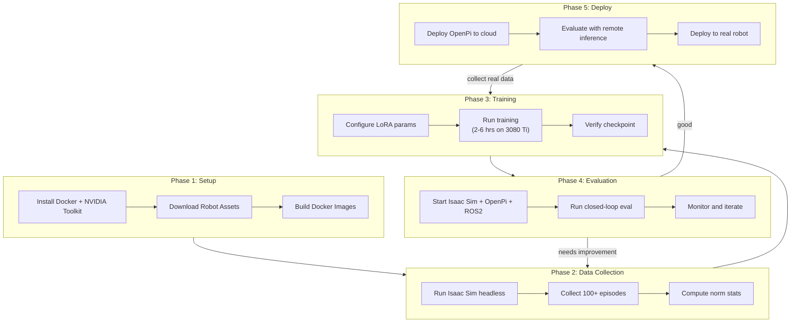

# Full End-to-End Example

This walkthrough demonstrates the complete workflow: from setup through data
collection, training, evaluation, and remote deployment.

---

## Scenario

You have:
- A local machine with an RTX 3080 Ti and 256 GB RAM
- (Optional) A cloud GPU instance for faster training/inference
- No physical robot yet (simulation only)

Goal: Train a pi0-FAST VLA model to reach targets with the SO-ARM101 in
Isaac Sim, then evaluate the trained policy in closed-loop simulation.

---

## Phase 1: Environment Setup

### 1.1 Install Prerequisites

```bash
# Docker
curl -fsSL https://get.docker.com | sh
sudo usermod -aG docker $USER
newgrp docker

# NVIDIA Container Toolkit
distribution=$(. /etc/os-release;echo $ID$VERSION_ID)
curl -fsSL https://nvidia.github.io/libnvidia-container/gpgkey | \
    sudo gpg --dearmor -o /usr/share/keyrings/nvidia-container-toolkit-keyring.gpg
curl -s -L https://nvidia.github.io/libnvidia-container/$distribution/libnvidia-container.list | \
    sed 's#deb https://#deb [signed-by=/usr/share/keyrings/nvidia-container-toolkit-keyring.gpg] https://#g' | \
    sudo tee /etc/apt/sources.list.d/nvidia-container-toolkit.list
sudo apt-get update && sudo apt-get install -y nvidia-container-toolkit
sudo nvidia-ctk runtime configure --runtime=docker
sudo systemctl restart docker

# NGC login (for Isaac Sim image)
docker login nvcr.io
```

### 1.2 Verify the Project

```bash
cd /path/to/isaac-sim-soarm101
bash scripts/smoke_test.sh
# Expected: 43 passed, 0 failed
```

### 1.3 Download Robot Assets

```bash
./scripts/setup_robot_usd.sh
```

This downloads:
- `robot_description/urdf/soarm101.urdf` -- Main URDF
- `robot_description/meshes/*.stl` -- 13 mesh files
- `robot_description/urdf/soarm101_isaacsim.urdf` -- Isaac Sim variant
- `robot_description/usd/soarm101.usd` -- USD asset (converted from URDF)

### 1.4 Build Docker Images

```bash
cd docker

# Build all images (first time takes 15-30 minutes)
docker compose --profile collect build
docker compose --profile train build
docker compose --profile eval-local build
```

---

## Phase 2: Data Collection

### 2.1 Collect Reach Episodes

Generate 100 episodes of the reach-target task with wrist camera images:

```bash
./scripts/collect_sim_data.sh --env reach --episodes 100 --camera
```

What happens behind the scenes:

```
1. Docker Compose starts the Isaac Sim container (headless)
2. sim_data_collector.py creates a SoarmReachEnv
3. For each episode:
   a. Environment resets with random target + initial joints
   b. Random policy executes actions for 5 seconds
   c. Joint states, actions, and camera images are recorded
4. Data saved to data/episodes/ in LeRobot v3.0 format
```

Expected output:

```
=== Collecting 100 episodes (env=reach) ===
Episode 1/100: 150 frames, 5.0s
Episode 2/100: 150 frames, 5.0s
...
Episode 100/100: 150 frames, 5.0s
=== Done. Episodes saved to data/episodes/ ===
```

### 2.2 Inspect the Data

```bash
# Check metadata
cat data/episodes/meta/info.json
# {
#   "codebase_version": "v3.0",
#   "robot_type": "so_arm101",
#   "fps": 30,
#   "total_episodes": 100,
#   "total_frames": 15000,
#   ...
# }

# Check episodes
ls data/episodes/meta/episodes/
# 000000.json  000001.json  ...  000099.json

# Check video files
ls data/episodes/videos/
# observation.images.wrist_episode_000000.mp4
# observation.images.wrist_episode_000001.mp4
# ...
```

### 2.3 Compute Normalization Statistics

```bash
python3 training/scripts/compute_norm_stats.py --data-dir data/episodes

cat data/episodes/meta/stats.json
```

---

## Phase 3: Training (Local)

### 3.1 Configure Training

Review `docker/.env` to confirm local training settings:

```bash
cat docker/.env
# TRAINING_BATCH_SIZE=1
# TRAINING_GRAD_ACCUM=8
# TRAINING_LORA_RANK=32
# TRAINING_QUANTIZE_BASE=true
```

These settings are optimized for the 3080 Ti (12 GB VRAM):
- QLoRA (4-bit quantized base model)
- Effective batch size of 8 (1 x 8 gradient accumulation)
- LoRA rank 32

### 3.2 Run Training

```bash
./scripts/train.sh
```

What happens:

```
1. Docker Compose starts the training container with GPU access
2. OpenPi's train.py loads:
   - pi0-FAST base model (4-bit quantized via bitsandbytes)
   - SoarmDataConfig from training/configs/soarm_config.py
   - Episode data from data/episodes/
3. LoRA adapters are trained on the SO-ARM101 data
4. Checkpoint saved to models/soarm_lora/
```

Expected output:

```
=== SO-ARM101 Training ===
Config:     soarm_pi0_fast
Output:     /models/soarm_lora
Batch size: 1 (grad accum: 8)
LoRA rank:  32
Quantize:   true

Step 100/5000 | loss: 2.34 | lr: 1e-4
Step 200/5000 | loss: 1.87 | lr: 1e-4
...
Step 5000/5000 | loss: 0.42 | lr: 1e-5
Training complete. Checkpoint saved.
```

Training time on 3080 Ti: approximately 2-6 hours depending on dataset size.

### 3.3 Verify Checkpoint

```bash
ls models/soarm_lora/
# adapter_model.safetensors  adapter_config.json  ...
```

---

## Phase 4: Evaluation

### 4.1 Run Closed-Loop Evaluation

```bash
./scripts/eval_sim.sh
```

What happens:

```
1. Docker Compose starts three containers simultaneously:
   - Isaac Sim: runs SoarmReachEnv, publishes /joint_states and /camera/*
   - OpenPi Server: loads the fine-tuned checkpoint, listens on port 8000
   - ROS2 Bridge: connects sensor topics to OpenPi, publishes /joint_commands
2. The VLA bridge node:
   a. Reads joint states and camera images
   b. Builds observation dict
   c. Sends to OpenPi server via WebSocket
   d. Receives action chunk
   e. Publishes joint commands at 10 Hz
3. Isaac Sim executes the commanded joint positions
4. Loop continues until stopped (Ctrl+C)
```

### 4.2 Monitor the Evaluation

In a separate terminal:

```bash
# Watch joint states
docker exec soarm-ros2-bridge bash -c \
    "source /opt/ros/humble/setup.bash && ros2 topic echo /joint_states --once"

# Watch commands being published
docker exec soarm-ros2-bridge bash -c \
    "source /opt/ros/humble/setup.bash && ros2 topic echo /joint_commands --once"

# Change the task prompt
docker exec soarm-ros2-bridge bash -c \
    "source /opt/ros/humble/setup.bash && \
     ros2 topic pub /vla/prompt std_msgs/msg/String 'data: \"reach the green target\"' --once"
```

### 4.3 Iterate

If the policy doesn't perform well:

1. Collect more episodes (200-500)
2. Add domain randomization (lighting, textures)
3. Train longer (10000 steps)
4. Try a lower LoRA rank (16) if overfitting

```bash
# Collect more data
./scripts/collect_sim_data.sh --env reach --episodes 200 --camera

# Retrain
./scripts/train.sh
```

---

## Phase 5: Remote Deployment (Optional)

If you have access to a cloud GPU:

### 5.1 Deploy to Cloud

```bash
./scripts/deploy_cloud.sh user@gpu-server.example.com
```

Output:
```
=== Deploying GPU stack to user@gpu-server.example.com ===
[1/4] Syncing Docker files...
[2/4] Syncing training configs...
[3/4] Building containers on remote...
[4/4] Starting OpenPi server...

=== Deployment complete ===
OpenPi server: wss://gpu-server.example.com:8443
```

### 5.2 Sync Data to Cloud

```bash
./scripts/sync_data.sh push user@gpu-server.example.com
```

### 5.3 Train on Cloud

```bash
./scripts/train.sh --remote user@gpu-server.example.com
```

This runs full-precision LoRA (no quantization needed on A100/H100),
with batch size 4 and gradient accumulation 4.

### 5.4 Evaluate with Remote Inference

```bash
./scripts/eval_sim.sh --remote gpu-server.example.com
```

Isaac Sim runs locally, but inference happens on the cloud GPU.  The
ROS2 bridge connects to the remote OpenPi server via `wss://` over the
network.

---

## Phase 6: Real Robot (Future)

When you have a physical SO-ARM101:

### 6.1 Install the Robot Driver

Set up the serial driver for the STS3215 servos.  It must publish
`/joint_states` and subscribe to `/joint_commands`.

### 6.2 Attach Cameras

Mount a wrist camera and (optionally) an overhead camera.  Run camera
driver nodes that publish to `/camera/wrist/image_raw` and
`/camera/overhead/image_raw`.

### 6.3 Deploy

```bash
# Local inference
./scripts/deploy_real.sh

# Remote inference (lower latency on LAN, action chunking on WAN)
./scripts/deploy_real.sh --remote gpu-server.example.com
```

### 6.4 Collect Real Data

Teleoperate the real robot while recording to the same LeRobot format.
Mix real data with sim data for co-training to improve transfer.

---

## Workflow Summary



---

## Timing Estimates

| Phase | Duration | Notes |
|---|---|---|
| Docker image builds | 15-30 min | One-time; cached after |
| Robot asset download | 2 min | Depends on network |
| Collect 100 episodes | 10-20 min | Headless Isaac Sim |
| Compute norm stats | < 1 min | |
| Train 5000 steps (local) | 2-6 hrs | 3080 Ti with QLoRA |
| Train 5000 steps (cloud A100) | 30-60 min | Full precision LoRA |
| Evaluation session | Continuous | Until Ctrl+C |
| Cloud deployment | 5-10 min | Build + start on remote |
