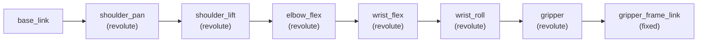

# Isaac Sim Environments

Details on the custom Isaac Lab environments for the SO-ARM101.

---

## Overview

Two Gymnasium-compatible environments are provided, built on NVIDIA's
Isaac Lab framework.  Both load the SO-ARM101 from its USD asset and run
inside the Isaac Sim physics engine.

| Environment | File | Task | Episode Length |
|---|---|---|---|
| **SoarmReachEnv** | `isaac_envs/soarm_reach_env.py` | Move EE to target | 5 s |
| **SoarmPickEnv** | `isaac_envs/soarm_pick_env.py` | Pick cube, place at target | 10 s |

---

## SO-ARM101 Robot Model

### Joint Configuration



### Actuator Properties

| Group | Joints | Stiffness | Damping | Effort Limit | Velocity Limit |
|---|---|---|---|---|---|
| Arm | shoulder_pan, shoulder_lift, elbow_flex, wrist_flex, wrist_roll | 80 | 4 | 30 Nm | 2 rad/s |
| Gripper | gripper | 80 | 4 | 10 Nm | 2 rad/s |

These approximate the STS3215 servos used in the real SO-ARM101.

---

## SoarmReachEnv

### Task

Move the end-effector (gripper_frame_link) to a randomly sampled 3D target
position within the robot's workspace.

### Observation Space

| Component | Dimension | Description |
|---|---|---|
| Joint positions | 6 | Current position of all 6 joints |
| Joint velocities | 6 | Current velocity of all 6 joints |
| Target position | 3 | XYZ target in world frame |
| **Total** | **15** | |
| Wrist camera (optional) | 224 x 224 x 3 | RGB image |

### Action Space

| Dimension | Range | Description |
|---|---|---|
| 6 | [-1, 1] | Scaled by `action_scale` (0.05 rad) and added to current joint positions |

### Reward

```
reward = -10 * distance_to_target + 5 * (distance < 2cm)
```

- Dense component proportional to end-effector distance from target
- Sparse bonus when within 2 cm (success threshold)

### Episode Termination

- **Success**: End-effector within 2 cm of target
- **Timeout**: 5 seconds (150 steps at 30 Hz policy rate)

### Domain Randomization

| Parameter | Range |
|---|---|
| Target X | 5 - 25 cm |
| Target Y | -15 - 15 cm |
| Target Z | 2 - 20 cm |
| Initial joint noise | Gaussian, sigma = 0.1 rad |

---

## SoarmPickEnv

Extends SoarmReachEnv with a manipulable cube.

### Task

Pick up a 3 cm cube from a random position and place it at a random target.

### Additional Observation

| Component | Dimension | Description |
|---|---|---|
| Cube position | 3 | XYZ in world frame |

Total observation: 15 (base) + 3 (cube) = **18**.

### Reward

Multi-phase reward:

```
reward = -5 * dist_ee_to_cube                              # reach
       + 2 * (grasped)                                     # grasp
       + 10 * (grasped AND cube_z > 5cm)                   # lift
       + 10 * (cube within 3cm of target)                  # place
```

### Additional Randomization

| Parameter | Range |
|---|---|
| Cube X | 8 - 22 cm |
| Cube Y | -10 - 10 cm |
| Cube Z | 1.5 cm (resting on table) |

---

## Simulation Parameters

| Parameter | Value |
|---|---|
| Physics dt | 1/120 s |
| Policy decimation | 4 (policy runs at 30 Hz) |
| Gravity | -9.81 m/s^2 |
| Solver iterations (pos) | 8 |
| Ground plane | Flat, at z=0 |
| Lighting | Dome light, 2000 lux |

---

## Camera Configuration

When `use_camera=True`, a pinhole camera is attached to the gripper frame:

| Parameter | Value |
|---|---|
| Resolution | 224 x 224 |
| Frame rate | 30 Hz |
| FOV | ~60 deg (focal_length=1.93mm, aperture=2.65mm) |
| Offset from gripper | (5cm, 0, 2cm) forward and up |
| Format | RGB uint8 |

---

## Third-person viewport camera

When running the environment with a **window** (GUI or livestream), the main viewport camera is configured to follow the robot so you can see the arm and target during testing.

- **Configuration**: `SoarmReachEnvCfg.viewer` uses Isaac Lab’s `ViewportCameraController` with `origin_type="asset_root"` and `asset_name="robot"`. The camera position (`eye`) and look-at point (`lookat`) are set so the robot base and workspace are in view. SoarmPickEnv inherits the same viewer.
- **When it applies**: Only when the env is run with a visible viewport (e.g. `render_mode="human"`). Headless data collection has no viewport; use the wrist-camera videos or the play script for visual verification.
- **How to see it**: Run the play script with a window or livestream (see below). If using the Docker container, connect with the [Isaac Sim WebRTC streaming client](https://docs.isaacsim.omniverse.nvidia.com/latest/installation/manual_livestream_clients.html) to view the simulation.

---

## Running Environments Standalone

**Play reach with third-person camera (GUI / livestream):**

```bash
# From host: run with livestream, then connect via WebRTC client
./scripts/play_reach.sh

# Or inside the container (with display or LIVESTREAM set):
/isaac-sim/python.sh /isaac_envs/play_reach.py
```

**Headless data collection:**

```bash
/isaac-sim/python.sh isaac_envs/sim_data_collector.py \
    --env reach --num-episodes 10 --output-dir /data/episodes
```

## Extending the Environments

To add a new task:

1. Copy `soarm_reach_env.py` as a starting point
2. Modify `_setup_scene()` to add new objects
3. Adjust `_get_observations()`, `_get_rewards()`, `_get_dones()`
4. Add domain randomization in `_reset_idx()`
5. Register with the data collector if needed
