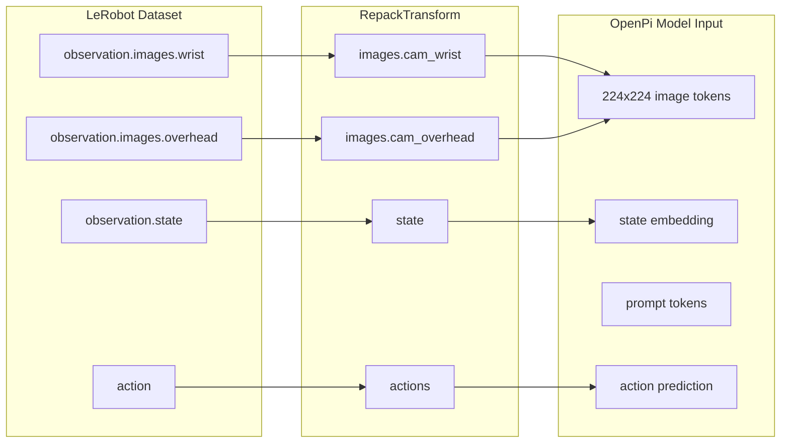
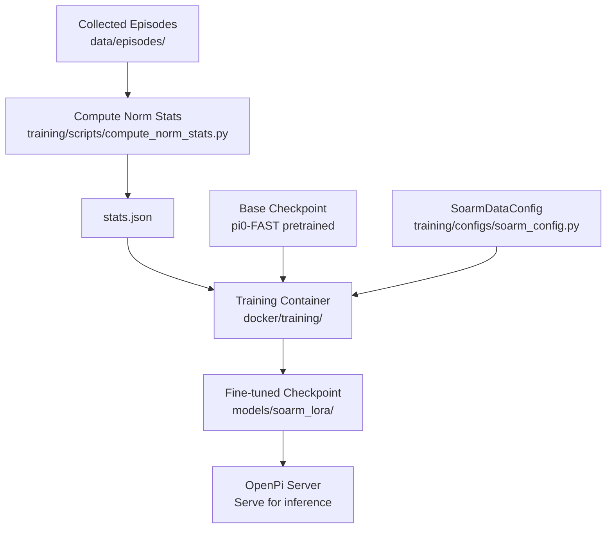

# OpenPi Training Guide

How VLA model fine-tuning works with the SO-ARM101 configuration.

---

## Model Options

| Model | Type | Base Params | Inference VRAM | LoRA VRAM | Speed |
|---|---|---|---|---|---|
| **pi0** | Flow-based diffusion VLA | ~3B | ~8 GB | ~24 GB | Slower |
| **pi0-FAST** | Autoregressive VLA | ~3B | ~6 GB | ~22 GB | Faster |
| **pi0.5** | Hierarchical VLA | ~3B | ~10 GB | ~28 GB | Medium |

**Recommendation**: Use `pi0-FAST` (`soarm_pi0_fast` config) for the
SO-ARM101.  It's faster at inference, uses less VRAM, and works well
with LoRA fine-tuning on small datasets.

---

## Training Configuration

### SoarmDataConfig

The custom configuration in `training/configs/soarm_config.py` maps
SO-ARM101 data to the format expected by OpenPi:



### Key Parameters

| Parameter | Local (3080 Ti) | Cloud (A100) | Description |
|---|---|---|---|
| `batch_size` | 1 | 4-8 | Samples per forward pass |
| `gradient_accumulation` | 8 | 4 | Effective batch = BS x GA |
| `lora_rank` | 32 | 32-64 | LoRA adapter rank |
| `quantize_base` | true (4-bit) | false (fp16) | Base model precision |
| `learning_rate` | 1e-4 | 1e-4 | Adam LR |
| `max_steps` | 5000 | 10000 | Training iterations |

These are set via environment variables in `docker/.env` or
`docker/.env.cloud`.

---

## Memory Budget (3080 Ti, 12 GB)

```
┌─────────────────────────────────────────────┐
│ 12 GB VRAM                                  │
├─────────────────────────────────────────────┤
│ Base model (4-bit quantized)    ~3.0 GB     │
│ LoRA adapters (rank 32, fp16)   ~0.3 GB     │
│ Activations + gradients          ~4.0 GB    │
│ Optimizer states (AdamW)   → CPU offload    │
│ Workspace / fragmentation       ~4.5 GB     │
├─────────────────────────────────────────────┤
│ Total GPU:                      ~11.8 GB    │
│ CPU RAM for offloading:         ~30 GB      │
└─────────────────────────────────────────────┘
```

The 256 GB system RAM provides ample headroom for DeepSpeed ZeRO-Offload.

---

## Training Workflow



### Step by Step

**1. Ensure episodes are collected:**

```bash
ls data/episodes/meta/info.json  # should exist
```

**2. Compute normalization stats** (if not done during collection):

```bash
# Inside training container or locally with pyarrow installed
python3 training/scripts/compute_norm_stats.py --data-dir data/episodes
```

**3. Run training:**

```bash
# Local
./scripts/train.sh

# Remote
./scripts/train.sh --remote user@gpu-server
```

**4. Check output:**

```bash
ls models/soarm_lora/
# Should contain checkpoint files
```

---

## Registering the Custom Config

The `SoarmDataConfig` needs to be registered with OpenPi's config system.
The training container's entrypoint copies `soarm_config.py` into the OpenPi
source tree automatically.

If running training manually, add to OpenPi's `_CONFIGS` dict in
`src/openpi/training/config.py`:

```python
from openpi.training.configs_custom.soarm_config import SOARM_CONFIGS
_CONFIGS.update(SOARM_CONFIGS)
```

---

## Monitoring

### TensorBoard

The training container logs to TensorBoard by default:

```bash
# Inside the training container
tensorboard --logdir /models/soarm_lora/logs --bind_all

# Or mount and view locally
tensorboard --logdir models/soarm_lora/logs
```

### Weights & Biases

The training container has `wandb` pre-installed.  Set your API key:

```bash
# In docker/.env or docker/.env.cloud
WANDB_API_KEY=your_key_here
```

---

## Tips for Small Datasets

With only 50-500 episodes from simulation:

1. **Start with pi0-FAST**: It converges faster than pi0 on small datasets.
2. **Use LoRA rank 16-32**: Higher ranks overfit on small data.
3. **Short training**: 1000-3000 steps is often enough for sim data.
4. **Evaluate frequently**: Run `eval_sim.sh` every ~500 steps.
5. **Add domain randomization**: Vary lighting, textures, and camera angles
   in the Isaac Lab environments to improve generalization.
6. **Mix sim and real data**: When you get real episodes, combine them with
   sim data for better transfer.
