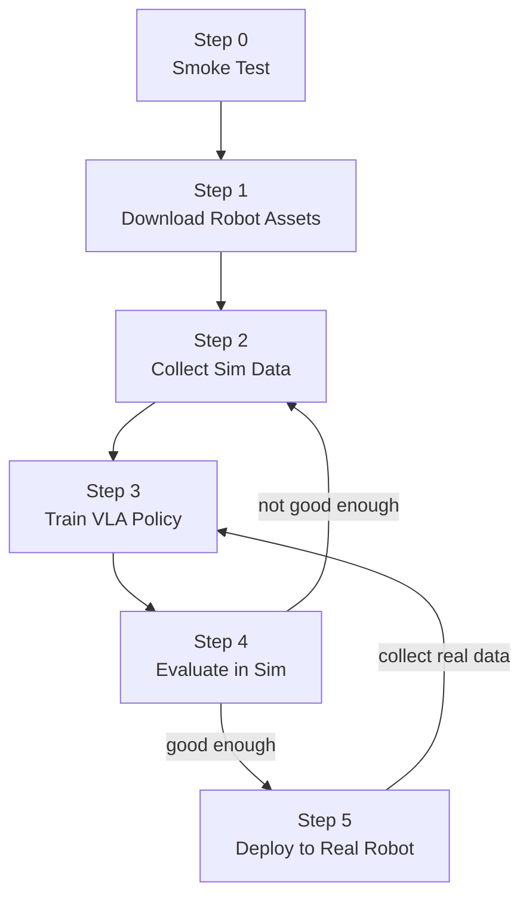

# Quick Start Guide

A step-by-step walkthrough for going from zero to a trained VLA policy
running in simulation, all on a single machine with an NVIDIA GPU.

---

## Prerequisites

### Hardware

- NVIDIA RTX 3070 or better (RT cores required for Isaac Sim)
- 12+ GB VRAM (3080 Ti recommended)
- 64+ GB system RAM (256 GB recommended for CPU-offloaded training)
- 100 GB free disk space

### Software

| Dependency | Minimum Version | Check |
|---|---|---|
| Ubuntu | 22.04 | `lsb_release -a` |
| NVIDIA Driver | 535.129.03 | `nvidia-smi` |
| Docker Engine | 26.0.0 | `docker --version` |
| Docker Compose | 2.25.0 | `docker compose version` |
| NVIDIA Container Toolkit | latest | `nvidia-ctk --version` |

### NGC Access (for Isaac Sim container)

```bash
# Create account at https://ngc.nvidia.com
# Generate API key at https://ngc.nvidia.com/setup/api-key
docker login nvcr.io
# Username: $oauthtoken
# Password: <your NGC API key>
```

---

## Step 0 -- Verify Your Setup

```bash
# Clone or navigate to the project
cd /path/to/isaac-sim-soarm101

# Run the offline smoke test (no GPU needed)
bash scripts/smoke_test.sh
```

Expected output: `Results: 43 passed, 0 failed`.

---

## Step 1 -- Download Robot Assets

Downloads the SO-ARM101 URDF and 13 STL mesh files from the
[TheRobotStudio/SO-ARM100](https://github.com/TheRobotStudio/SO-ARM100)
repository, and attempts a URDF-to-USD conversion for Isaac Sim.

```bash
./scripts/setup_robot_usd.sh
```

If the automated USD conversion fails (common on first run), you can
convert manually later inside the Isaac Sim GUI (see below).

#### Opening the URDF from the Isaac Sim Docker image

You can open and import the URDF using Isaac Sim running in Docker in two ways.

**Option A – GUI via headless + streaming (recommended)**

Isaac Sim in Docker is intended to run headless; you interact with it via the WebRTC streaming client.

1. Start the container. Prefer running **as your host user** so the URDF importer can write to `robot_description` without permission fixes:

   ```bash
   cd /path/to/isaac-sim_soarm101
   ./scripts/run_isaac_sim_gui.sh
   ```

   The script follows the [official Container Installation](https://docs.isaacsim.omniverse.nvidia.com/5.1.0/installation/install_container.html) layout (cache/main, config, data, logs, pkg) and runs as your user so no `chown` is needed. Use `ISAAC_SIM_TAG=5.1.0` to use Isaac Sim 5.1. Alternatively, run the container as root and make the importer dir writable first:
   ```bash
   ./scripts/prepare_urdf_import_dir.sh
   docker run --name isaac-sim --entrypoint bash -it --rm --runtime=nvidia --gpus all \
     -e ACCEPT_EULA=Y -e PRIVACY_CONSENT=Y \
     -v "$(pwd)/robot_description:/robot_description" \
     -v isaac-cache-kit:/isaac-sim/kit/cache \
     -v isaac-cache-ov:/root/.cache/ov \
     -v isaac-cache-glcache:/root/.cache/nvidia/GLCache \
     -v isaac-cache-compute:/root/.nv/ComputeCache \
     -v isaac-logs:/root/.nvidia-omniverse/logs \
     nvcr.io/nvidia/isaac-sim:5.1.0
   ```

2. (Optional) Inside the container, run the compatibility check: `bash isaac-sim.compatibility_check.sh --/app/quitAfter=10 --no-window` (see [official Container Installation](https://docs.isaacsim.omniverse.nvidia.com/5.1.0/installation/install_container.html)).

3. Inside the container, start Isaac Sim in headless streaming mode (use `bash` so the script runs without needing execute bit on root-owned files):

   ```bash
   bash runheadless.sh -v
   ```

   Wait until the log shows: `Isaac Sim Full Streaming App is loaded.`

4. On your workstation, open the [Isaac Sim WebRTC Streaming Client](https://docs.isaacsim.omniverse.nvidia.com/5.1.0/installation/manual_livestream_clients.html), enter the host’s IP, and connect.

5. In the streamed Isaac Sim window: **File > Import**, choose **URDF**, and select:
   `/robot_description/urdf/soarm101_isaacsim.urdf`  
   (Use the path inside the container; the client shows the same scene as the container.)

6. In the import dialog: **Static Base = ON**, **Allow Self-Collision = ON**, then import. The importer writes to `/robot_description/urdf/soarm101_isaacsim/soarm101_isaacsim.usd` (this path cannot be changed in the GUI). On the host, copy it to the path the project expects:
   ```bash
   ./scripts/copy_urdf_import_to_usd.sh
   ```

**Option B – Headless only (no GUI)**

To convert URDF → USD without opening the GUI, use the project script (from the host) or the converter inside the container:

- From host (uses the same image and mounts):

  ```bash
  ./scripts/setup_robot_usd.sh
  ```

- Or inside the container: use the project’s built image (includes `convert_urdf.py`):

  ```bash
  cd docker && docker compose build isaac-sim && cd ..
  docker run --rm --runtime=nvidia -e ACCEPT_EULA=Y -e PRIVACY_CONSENT=Y \
    -v "$(pwd)/robot_description:/robot_description" \
    soarm-isaac-sim \
    /isaac-sim/python.sh /usr/local/bin/convert_urdf.py \
      --urdf /robot_description/urdf/soarm101_isaacsim.urdf \
      --out  /robot_description/usd/soarm101.usd
  ```

  The stock `nvcr.io/nvidia/isaac-sim:5.1.0` image does not include `convert_urdf.py`; running `./scripts/setup_robot_usd.sh` from the host uses the same image and performs the conversion for you.

**Manual conversion steps (once Isaac Sim is open, e.g. via Option A)**

1. Run `./scripts/prepare_urdf_import_dir.sh` on the host so the importer can write.
2. Open Isaac Sim (via streaming client or local display). Use a **read-write** mount for `robot_description`.
3. File > Import > select `/robot_description/urdf/soarm101_isaacsim.urdf`.
4. Settings: Static Base = ON, Allow Self-Collision = ON, then import. The importer writes to `robot_description/urdf/soarm101_isaacsim/soarm101_isaacsim.usd`.
5. On the host: `./scripts/copy_urdf_import_to_usd.sh` to copy that file to `robot_description/usd/soarm101.usd`.

---

## Step 2 -- Collect Simulation Data

Generate training demonstrations by running the SO-ARM101 in Isaac Sim with
an IK-based scripted policy.  The robot smoothly reaches randomly sampled
target positions using a differential IK controller.  Camera images (wrist
and third-person) are captured by default, and each frame includes a language
instruction for VLA conditioning.  Data is saved in LeRobot v3.0 format.

Ensure **Step 1** is done so `robot_description/usd/soarm101.usd` exists; otherwise the collector will fail when loading the env.

```bash
# 50 reach-target episodes with cameras (5-10 minutes on a 3080 Ti)
./scripts/collect_sim_data.sh --env reach --episodes 50

# Skip camera capture (not recommended for VLA training)
./scripts/collect_sim_data.sh --env reach --episodes 50 --no-camera

# Pick-and-place episodes
./scripts/collect_sim_data.sh --env pick --episodes 50
```

**Important:** Delete any previously collected data in `data/episodes/` before
running a new collection.  Old random-policy data will degrade training quality.

```bash
rm -rf data/episodes/*
```

You will see "Simulation App Starting" and "app ready" first; then "Loading environment (this can take 1-2 min on first run)" and "Environment ready. Collecting episodes...". Episode lines (e.g. "Episode 1/50: 85 steps (REACHED)") appear as each episode finishes, showing whether the robot successfully reached the target. If you only see startup logs, wait 1-2 minutes for the env to load, or see [TROUBLESHOOTING](TROUBLESHOOTING.md) ("collect_sim_data only shows Isaac Sim startup").

### Live-viewing collection via WebRTC

Add `--watch` to see the robot move in real time through the Isaac Sim WebRTC Streaming Client:

```bash
./scripts/collect_sim_data.sh --env reach --episodes 50 --watch
```

The script pauses after the environment loads so you can connect the streaming client before collection starts. Press Enter in the terminal once connected.

If connecting from a different machine on the network, specify your host IP:

```bash
./scripts/collect_sim_data.sh --env reach --episodes 50 --watch --public-ip 192.168.1.50
```

Requirements: an NVENC-capable GPU (RTX series; A100 is not supported) and the [Isaac Sim WebRTC Streaming Client](https://docs.isaacsim.omniverse.nvidia.com/latest/installation/download.html#isaac-sim-latest-release) app. Only one client can connect at a time.

After collection, inspect the output:

```bash
ls data/episodes/meta/          # info.json, stats.json, episodes/
ls data/episodes/data/          # Parquet shards
ls data/episodes/videos/        # per-episode MP4s (wrist + third_person per episode)
cat data/episodes/meta/info.json
```

---

## Step 3 -- Train a VLA Policy

Fine-tune a pi0-FAST model on the collected episodes using LoRA.

### Local Training (3080 Ti, QLoRA)

```bash
./scripts/train.sh
```

This runs inside the training Docker container with:
- 4-bit quantized base model (QLoRA)
- Batch size 1, gradient accumulation 8
- LoRA rank 32
- CPU offloading for optimizer states (uses your 256 GB RAM)

Training parameters are configured in `docker/.env`:

```bash
TRAINING_BATCH_SIZE=1
TRAINING_GRAD_ACCUM=8
TRAINING_LORA_RANK=32
TRAINING_QUANTIZE_BASE=true
```

### Remote Training (Cloud GPU)

See [Remote Deployment](REMOTE_DEPLOYMENT.md) for setting up a cloud GPU.
Once deployed:

```bash
./scripts/train.sh --remote user@gpu-server
```

---

## Step 4 -- Evaluate in Simulation

Run the trained policy in closed-loop simulation.

### Local Inference

```bash
./scripts/eval_sim.sh
```

This starts three containers simultaneously:
1. **Isaac Sim** -- runs the SO-ARM101 environment
2. **OpenPi Server** -- loads the fine-tuned checkpoint from `models/`
3. **ROS2 Bridge** -- connects sensors to the policy server

### Live-viewing evaluation via WebRTC

Add `--watch` to stream the simulation viewport so you can see the policy in action:

```bash
./scripts/eval_sim.sh --watch
./scripts/eval_sim.sh --watch --public-ip 192.168.1.50   # connect from another machine
```

### Remote Inference

```bash
./scripts/eval_sim.sh --remote gpu-server.example.com
```

Only Isaac Sim + ROS2 run locally; the policy server runs on the remote GPU.

---

## Step 5 -- Deploy to Real Robot (Future)

When you have a physical SO-ARM101:

```bash
# Local inference
./scripts/deploy_real.sh

# Remote inference
./scripts/deploy_real.sh --remote gpu-server.example.com
```

The ROS2 bridge uses the same topics whether connected to Isaac Sim or real
hardware.  You only need to run the appropriate robot driver node that
publishes `/joint_states` and subscribes to `/joint_commands`.

---

## Workflow Diagram



---

## What Each Script Does

| Script | Purpose | GPU Required |
|---|---|---|
| `scripts/smoke_test.sh` | Validate project structure and offline tests | No |
| `scripts/setup_robot_usd.sh` | Download URDF/STL, convert to USD | Yes (Isaac Sim) |
| `scripts/collect_sim_data.sh` | Run Isaac Sim, record episodes | Yes |
| `scripts/train.sh` | LoRA fine-tuning on collected data | Yes |
| `scripts/eval_sim.sh` | Closed-loop evaluation in sim | Yes |
| `scripts/deploy_real.sh` | Run policy on real robot | Yes (inference) |
| `scripts/deploy_cloud.sh` | Deploy GPU stack to remote machine | Remote GPU |
| `scripts/sync_data.sh` | Sync episodes/checkpoints with remote | No |
