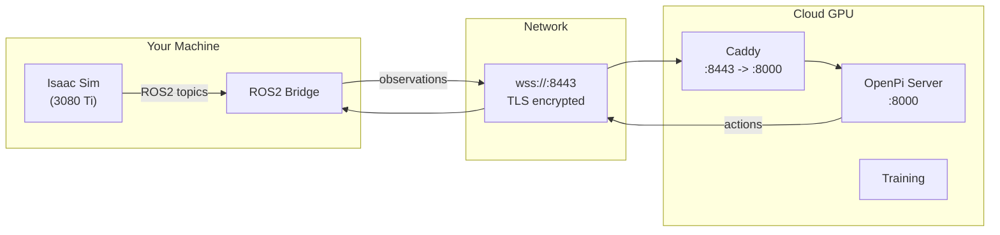
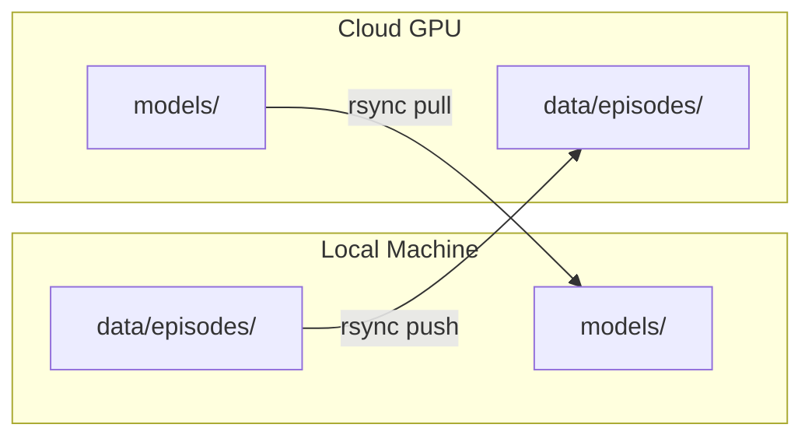

# Remote / Cloud Deployment

How to run the OpenPi inference server and training on a remote GPU machine,
while keeping Isaac Sim and the ROS2 bridge running locally.

---

## Why Remote?

| Concern | All Local (Mode A) | Split Remote (Mode B) |
|---|---|---|
| GPU contention | Must time-share 12 GB VRAM | Eliminated |
| Training precision | QLoRA only (4-bit base) | Full LoRA or full fine-tune |
| Inference speed | Competing with Isaac Sim | Dedicated GPU |
| Cost | Free (your hardware) | ~$0.30 - $2/hr cloud GPU |

---

## Architecture



---

## Cloud GPU Recommendations

| Use Case | GPU | VRAM | Approx. Cost/hr | Notes |
|---|---|---|---|---|
| Inference only | T4 | 16 GB | $0.30 | Cheapest; quantized pi0-FAST |
| LoRA fine-tuning | A10G | 24 GB | $0.75 | No quantization needed |
| Full fine-tuning | A100 | 80 GB | $2.00 | Full-parameter pi0-FAST |
| Large scale | H100 | 80 GB | $3.50 | Fastest training |

Providers: AWS, GCP, Lambda Labs, RunPod, Vast.ai.

---

## Setup Steps

### 1. Prepare the Remote Host

The remote machine needs:

```bash
# Docker Engine 26.0+
curl -fsSL https://get.docker.com | sh

# NVIDIA Container Toolkit
distribution=$(. /etc/os-release;echo $ID$VERSION_ID)
curl -fsSL https://nvidia.github.io/libnvidia-container/gpgkey | \
    sudo gpg --dearmor -o /usr/share/keyrings/nvidia-container-toolkit-keyring.gpg
curl -s -L https://nvidia.github.io/libnvidia-container/$distribution/libnvidia-container.list | \
    sed 's#deb https://#deb [signed-by=/usr/share/keyrings/nvidia-container-toolkit-keyring.gpg] https://#g' | \
    sudo tee /etc/apt/sources.list.d/nvidia-container-toolkit.list
sudo apt-get update && sudo apt-get install -y nvidia-container-toolkit
sudo nvidia-ctk runtime configure --runtime=docker
sudo systemctl restart docker

# Verify
docker run --rm --gpus all nvidia/cuda:12.4.0-base-ubuntu22.04 nvidia-smi
```

### 2. Deploy with One Command

```bash
./scripts/deploy_cloud.sh user@gpu-server.example.com
```

This script:
1. Creates `~/soarm/` directory structure on the remote host
2. Copies `docker-compose.cloud.yml`, Dockerfiles, and configs via rsync
3. Builds the Docker images on the remote host
4. Starts the OpenPi server and Caddy proxy

### 3. Update Local Config

Edit `docker/.env`:

```bash
OPENPI_HOST=gpu-server.example.com
OPENPI_PORT=8443
```

Or pass inline:

```bash
OPENPI_HOST=gpu-server.example.com OPENPI_PORT=8443 \
    docker compose --profile eval-remote up
```

### 4. Verify Connection

```bash
# From your local machine, test the WebSocket endpoint
curl -k https://gpu-server.example.com:8443
# Should return a WebSocket upgrade error (expected -- it's not HTTP)

# Or use the eval profile
./scripts/eval_sim.sh --remote gpu-server.example.com
```

---

## Data Synchronization

Episodes are generated locally (Isaac Sim) and consumed remotely (training).
Checkpoints are generated remotely and consumed locally (inference eval).



### Commands

```bash
# Push episodes to cloud
./scripts/sync_data.sh push user@gpu-server

# Pull checkpoints from cloud
./scripts/sync_data.sh pull user@gpu-server

# Both directions
./scripts/sync_data.sh both user@gpu-server
```

### Using S3/GCS Instead

For large-scale or multi-user setups, use cloud storage as an intermediary:

```bash
# Upload
aws s3 sync data/episodes/ s3://your-bucket/soarm/episodes/

# On cloud
aws s3 sync s3://your-bucket/soarm/episodes/ ~/soarm/data/episodes/

# After training
aws s3 sync ~/soarm/models/ s3://your-bucket/soarm/models/

# Download locally
aws s3 sync s3://your-bucket/soarm/models/ models/
```

---

## Remote Training

```bash
# One-command: pushes data, trains, pulls checkpoint
./scripts/train.sh --remote user@gpu-server

# Or manually:
./scripts/sync_data.sh push user@gpu-server
ssh user@gpu-server "cd ~/soarm/docker && \
    docker compose -f docker-compose.cloud.yml run --rm training"
./scripts/sync_data.sh pull user@gpu-server
```

---

## TLS Configuration

### Development (Self-Signed)

The default Caddyfile uses port `:8443` which generates self-signed
certificates automatically:

```
:8443 {
    reverse_proxy openpi-server:8000
}
```

### Production (Let's Encrypt)

Point a domain at your cloud server's IP and update the Caddyfile:

```
gpu.yourdomain.com {
    reverse_proxy openpi-server:8000
}
```

Caddy will automatically obtain and renew Let's Encrypt certificates.

### SSH Tunnel (Alternative)

For maximum simplicity without TLS:

```bash
# On local machine
ssh -L 8000:localhost:8000 user@gpu-server

# Then use localhost:8000 as the OpenPi endpoint
OPENPI_HOST=localhost OPENPI_PORT=8000 ./scripts/eval_sim.sh
```

---

## Latency

| Network | Round-trip | Impact |
|---|---|---|
| Localhost | < 1 ms | None |
| LAN | 1-5 ms | Imperceptible at 10 Hz |
| WAN (same region) | 20-50 ms | Minimal with action chunking |
| WAN (cross-region) | 50-100 ms | Acceptable with action chunking |

**Action chunking** makes WAN latency tolerable.  Each inference call
returns a chunk of N future actions (typically 10-50).  The ROS2 bridge
executes these locally at full 10 Hz rate while the next inference
round-trips over the network in the background.

```
Time ─────────────────────────────────────────────>

Bridge:  [execute a0] [a1] [a2] ... [aN]  [b0] [b1] ...
                                          ↑
Server:  ├─── infer(obs) ─── chunk A ────┤├── infer ── chunk B ──┤
         ├──────── 50ms network ─────────┤
```
