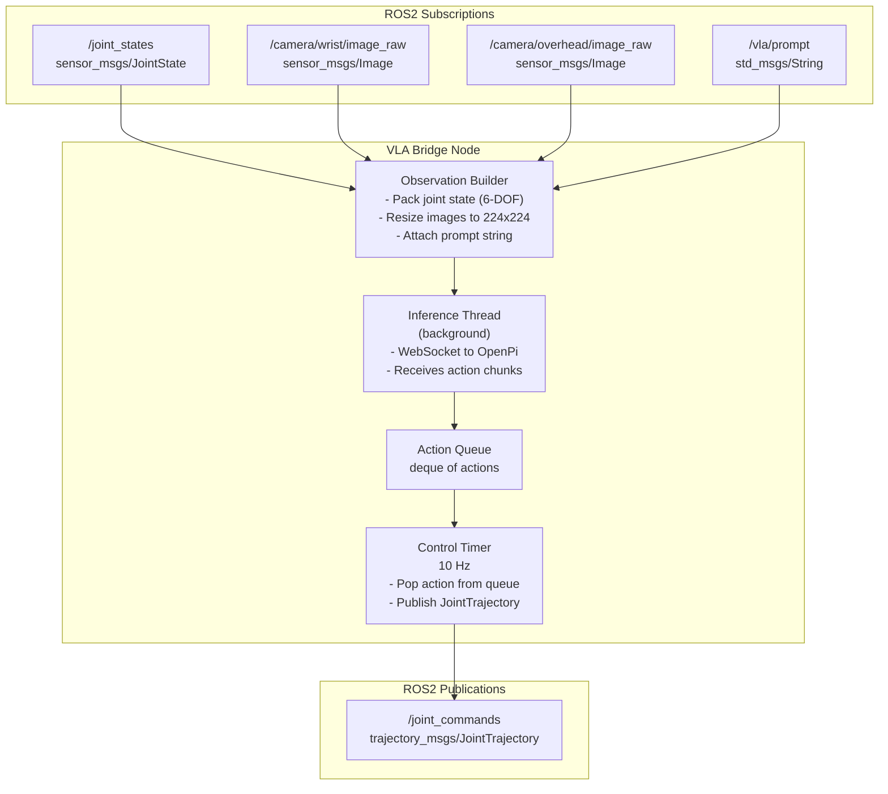

# ROS2 Bridge

How the VLA bridge node connects robot sensors to the OpenPi policy server.

---

## Overview

The `soarm_vla_bridge` ROS2 package is the critical link between the
robot (simulated or real) and the VLA policy.  It:

1. **Subscribes** to sensor topics (joint states, cameras)
2. **Builds** an observation dict
3. **Sends** the observation to the OpenPi server via WebSocket
4. **Receives** an action chunk (N future actions)
5. **Publishes** actions one at a time on a 10 Hz timer



---

## ROS2 Topics

### Subscribed

| Topic | Type | QoS | Description |
|---|---|---|---|
| `/joint_states` | `sensor_msgs/JointState` | Best Effort, depth=1 | 6 joint positions |
| `/camera/wrist/image_raw` | `sensor_msgs/Image` | Best Effort, depth=1 | Wrist camera RGB |
| `/camera/overhead/image_raw` | `sensor_msgs/Image` | Best Effort, depth=1 | Overhead camera RGB (optional) |
| `/vla/prompt` | `std_msgs/String` | Reliable, depth=10 | Task instruction |

### Published

| Topic | Type | Rate | Description |
|---|---|---|---|
| `/joint_commands` | `trajectory_msgs/JointTrajectory` | 10 Hz | Target joint positions |

### Joint Names

The `JointTrajectory` message uses these joint names in order:

```
shoulder_pan, shoulder_lift, elbow_flex, wrist_flex, wrist_roll, gripper
```

---

## Node Parameters

| Parameter | Default | Env Var | Description |
|---|---|---|---|
| `openpi_host` | `localhost` | `OPENPI_HOST` | OpenPi server hostname |
| `openpi_port` | `8000` | `OPENPI_PORT` | OpenPi server port |
| `control_rate` | `10.0` | -- | Action publishing rate (Hz) |
| `prompt` | `"move the robot arm to the target"` | -- | Default task prompt |
| `action_chunk_size` | `1` | -- | Expected actions per inference |

### Setting Parameters

```bash
# Via environment (docker-compose)
OPENPI_HOST=gpu-server.com OPENPI_PORT=8443

# Via ROS2 launch
ros2 run soarm_vla_bridge vla_bridge --ros-args \
    -p openpi_host:=gpu-server.com \
    -p openpi_port:=8443 \
    -p prompt:="pick up the red cube"
```

---

## Action Chunking for Latency Tolerance

The inference thread runs independently of the control timer.  This
decouples inference latency from the control rate:

```
Timeline ──────────────────────────────────────────>

Inference thread:
    ├── request obs ── wait ~50ms ── receive [a0..a9] ──┤
    ├── request obs ── wait ~50ms ── receive [b0..b9] ──┤

Action queue:
    [a0, a1, a2, a3, a4, a5, a6, a7, a8, a9, b0, b1, ...]

Control timer (10 Hz):
    t=0: publish a0
    t=100ms: publish a1
    t=200ms: publish a2
    ...
    t=900ms: publish a9
    t=1000ms: publish b0  (new chunk arrived)
```

This means even with 50-100 ms network latency, the robot continues
executing smoothly at 10 Hz.

---

## Observation Format

The observation dict sent to OpenPi:

```python
{
    "state": np.array([0.1, -0.2, 0.3, -0.1, 0.0, 0.0], dtype=float32),
    "images": {
        "cam_wrist": np.array(shape=(224, 224, 3), dtype=uint8),
        "cam_overhead": np.array(shape=(224, 224, 3), dtype=uint8),  # optional
    },
    "prompt": "pick up the red cube",
}
```

The `observation_builder.py` module handles:
- Extracting joint positions from the `JointState` message in the correct order
- Resizing camera images to 224x224 (using OpenCV or PIL)
- Converting BGR to RGB if needed
- Packaging everything into the dict format expected by `openpi-client`

---

## Changing the Task Prompt at Runtime

Publish a string to `/vla/prompt`:

```bash
ros2 topic pub /vla/prompt std_msgs/msg/String "data: 'pick up the blue cube'" --once
```

The bridge node updates its prompt immediately and uses it for all
subsequent inference calls.

---

## Connecting to a Real Robot

The bridge node is robot-agnostic.  It only cares about the ROS2 topics
listed above.  To connect to a real SO-ARM101:

1. Run a hardware driver that publishes `/joint_states` and subscribes
   to `/joint_commands` (e.g., a serial driver for the STS3215 servos).
2. Run a camera driver that publishes `/camera/wrist/image_raw`.
3. Start the bridge node.

The same bridge node works for both simulation and real hardware.

---

## Packages in ros2_ws

### soarm_description

| File | Purpose |
|---|---|
| `urdf/soarm101.urdf` | Robot model (symlink to robot_description/) |
| `meshes/*.stl` | Visual/collision meshes (symlink) |
| `launch/display.launch.py` | Launch robot_state_publisher + joint_state_publisher_gui |

### soarm_moveit_config

Placeholder MoveIt2 configuration.  Contains `soarm101.srdf` with arm and
gripper group definitions.  Generate a full config using the MoveIt Setup
Assistant when ready.

### soarm_vla_bridge

| File | Purpose |
|---|---|
| `vla_bridge_node.py` | Main ROS2 node |
| `observation_builder.py` | Observation dict construction |

---

## Building the Workspace

The ROS2 bridge container builds the workspace automatically on first start.
To rebuild manually:

```bash
# Inside the container
cd /ros2_ws
colcon build --symlink-install
source install/setup.bash
```
